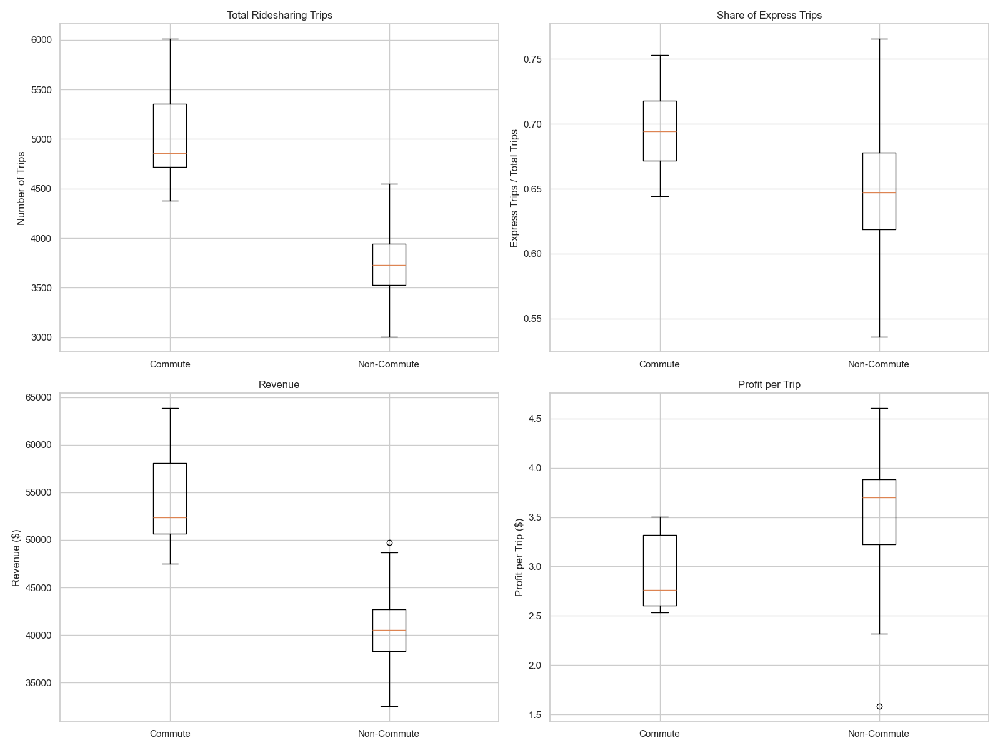

# Problem 1: UberPOOL and Commuting versus Non-Commuting Hours Analysis

## Introduction

This report examines data from Uber's Express POOL switchback experiment, specifically focusing on comparing commuting hours versus non-commuting hours in the control group (i.e., with 2-minute wait times). The analysis aims to answer key questions about ridership patterns, revenue, and profitability differences between these time periods.

## Dataset Overview

The dataset contains data from a switchback experiment run in Boston between February 19, 2018, and March 5, 2018. Each day was divided into 9 time periods of 160 minutes each. For this analysis, we focused only on the control group data, where riders waited up to 2 minutes before matching.

**Sample sizes:**

- Commuting hours: 10 observation periods
- Non-commuting hours: 53 observation periods

Commuting hours are defined as time periods during rush hours (7-9:40AM or 3-5:40PM).

## Key Findings

### 1. Ridership Volume

**Question 1-3: Do commuting hours experience a higher number of ridesharing trips compared to non-commuting hours?**

- **Answer: YES**
- Mean trips during commuting hours: 5,046.00
- Mean trips during non-commuting hours: 3,763.40
- Difference: 1,282.60 trips
- This difference is **statistically significant** (p-value < 0.0001)

This suggests that ridership volume is substantially higher during commuting hours, which is expected as people use ridesharing services to get to and from work.

### 2. Express POOL Usage

**Question 4-6: Do riders use Express at higher rates during commuting hours compared to non-commuting hours?**

- **Answer: YES**
- Express share during commuting hours: 69.81%
- Express share during non-commuting hours: 64.80%
- Difference: 5.01%
- This difference is **statistically significant** (p-value = 0.0016)

This indicates that during commuting hours, riders are more willing to use Express POOL (which may involve more walking but at a lower price) compared to regular POOL. This might be due to more price sensitivity during regular commutes or higher willingness to walk during daytime hours.

### 3. Revenue Analysis

**Question 7-8: What is the difference in revenues between commuting and non-commuting hours?**

- **Answer: $13,310.97 more during commuting hours**
- Mean revenue during commuting hours: $54,256.25
- Mean revenue during non-commuting hours: $40,945.28
- This difference is **statistically significant** (p-value < 0.0001)

The higher revenue during commuting hours is directly related to the significantly larger number of rides during these periods, despite the higher proportion of lower-priced Express rides.

### 4. Profit per Trip

**Question 9-10: What is the difference in profits per trip between commuting and non-commuting hours?**

- **Answer: $0.6575 less per trip during commuting hours**
- Mean profit per trip during commuting hours: $2.9421
- Mean profit per trip during non-commuting hours: $3.5996
- This difference is **statistically significant** (p-value = 0.0003)

Interestingly, while total revenue is higher during commuting hours, the profit per trip is actually lower. This suggests that during peak hours, Uber might be incurring higher costs per trip, possibly due to higher driver payouts, congestion, or other operational factors.

## Visual Analysis



The boxplots above provide a visual comparison of the key metrics between commuting and non-commuting hours.

## Conclusions and Business Implications

1. **Higher Ridership During Commuting Hours**: The significantly higher number of rides during commuting hours indicates a strong demand during peak travel times. This suggests that Uber should ensure sufficient driver availability during these periods.

2. **Express POOL Preference During Commuting Hours**: The higher proportion of Express POOL usage during commuting hours suggests that commuters are more price-sensitive or more flexible with their pickup and dropoff locations during regular commutes. This could inform pricing and marketing strategies specifically for commuting hours.

3. **Revenue vs. Profit Trade-off**: While commuting hours generate significantly more revenue, the lower profit per trip indicates that these periods might be operationally more expensive. Uber might want to investigate ways to improve operational efficiency during peak hours to increase profitability.

4. **Potential Strategy Considerations**:
   - Consider different pricing strategies for commuting vs. non-commuting hours
   - Focus on improving matching efficiency during commuting hours to improve per-trip profitability
   - Investigate the factors contributing to lower profit per trip during commuting hours (e.g., traffic congestion, driver incentives, etc.)

This analysis provides valuable insights into how rider behavior and Uber's operational metrics differ between commuting and non-commuting hours, which can inform business decisions and strategies to optimize both service quality and profitability.

## Methodology

The analysis was conducted using Python with pandas for data manipulation, scipy for statistical testing, and matplotlib/seaborn for visualization. Two-sample t-tests assuming unequal variances were used to assess the statistical significance of differences between metrics for commuting and non-commuting hours, with a significance level of 5%.

```python
# Key code snippet for t-test
def run_ttest(group1, group2):
    t_stat, p_val = stats.ttest_ind(group1, group2, equal_var=False)
    significant = p_val < 0.05
    return t_stat, p_val, significant
```

The complete code and detailed analysis is available in the `analyze_problem1.py` script.
